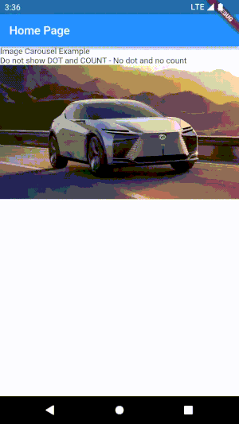
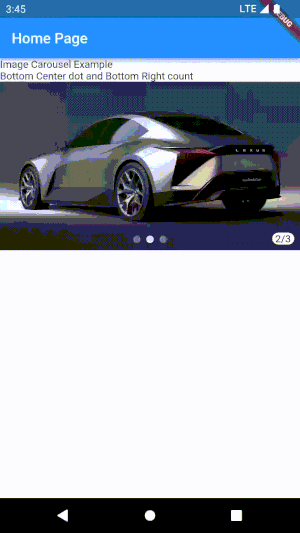
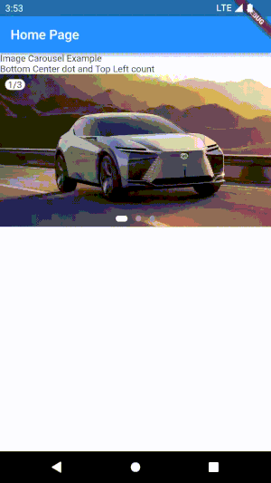
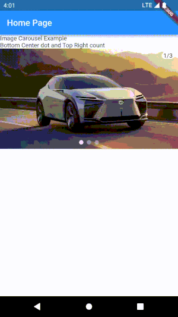
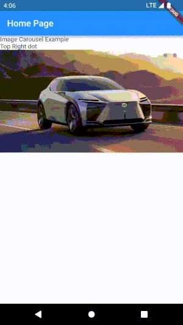

Dewan Image Carousel: Highly configurable Image Carousel that runs in a efficient way. You can place your DOT and COUNT in different position and can add Out Of Stock overlay


## Getting started
Flutter and Dart version : 3.3.10 / 2.18.0
#### Install : In your `pubspec.yaml`  under `dependencies:` add the following code to use it directly from git.
```
 dewan_image_carousel:    
    git:
      url: https://github.com/rddewan/dewan-image-carousel
      path: 
```
Once you have installed the package you can import the package as shown below and start using it.

`import 'package:dewan_image_carousel/dewan_image_carousel.dart';`

## Usage

For complete example please check the `/example` folder.

```dart
  // Do not show DOT and COUNT - No dot and no count
  const Text(
    'Empty Image - ',
  ),

  // Empty image list - return a empty sizeBox
  const BCBLImageCarousel(
    images: [], 
    height: 200, 
    boxColor: Colors.pinkAccent,
    positionTextStyle: TextStyle(color: Colors.white),  
    boxFit: BoxFit.cover,
    autoPlay: true, 
    dotColor: Colors.greenAccent,  
    showCount: false,
    showDot: false,
    isOutOfStock: true,
    outOfStockText: "SOLD OUT", 
    outOfStockTextStyle: TextStyle(color: Colors.white),
  ),

  // Do not show DOT and COUNT - No dot and no count
  const Text(
    'Do not show DOT and COUNT - No dot and no count',
  ),
  BCBLImageCarousel(
    images: images,
    boxColor: Colors.pinkAccent,
    positionTextStyle: const TextStyle(color: Colors.white),  
    boxFit: BoxFit.fill,
    autoPlay: true, 
    dotColor: Colors.greenAccent,  
    showCount: false,
    showDot: false,
    isOutOfStock: true,
    outOfStockText: "SOLD OUT", 
    outOfStockTextStyle: const TextStyle(color: Colors.white),
  ),
  const SizedBox(height: 8,),

  // Bottom Center dot and Bottom Left count
  const Text(
    'Bottom Center dot and Bottom Left count',
  ),
  BCBLImageCarousel(
    images: images,              
    boxColor: Colors.white,
    positionTextStyle: const TextStyle(color: Colors.black),  
    boxFit: BoxFit.fill,
    autoPlay: true, 
    dotColor: Colors.white,
    dotType: DotType.rounded, 
    isOutOfStock: true,
    outOfStockText: "SOLD OUT", 
    outOfStockTextStyle: const TextStyle(color: Colors.white),                
  ),
  const SizedBox(height: 8,),

  // Bottom Center dot and Bottom Right count
  const Text(
    'Bottom Center dot and Bottom Right count',
  ),
  BCBRImageCarousel(
    images: images,             
    boxColor: Colors.white,
    positionTextStyle: const TextStyle(color: Colors.black),  
    boxFit: BoxFit.fill,
    autoPlay: true, 
    dotColor: Colors.white,  
    showCount: true,
    showDot: true,
  ),
  const SizedBox(height: 8,),

  // Bottom Center dot and Top Left count
  const Text(
    'Bottom Center dot and Top Left count',
  ),
  BCTLImageCarousel(
    images: images, 
    height: 200, 
    boxColor: Colors.white,
    positionTextStyle: const TextStyle(color: Colors.black),  
    boxFit: BoxFit.fill,
    autoPlay: true, 
    dotColor: Colors.white,
    dotType: DotType.rounded,                
  ),
  const SizedBox(height: 8,),

  // Bottom Center dot and Top Right count
  const Text(
    'Bottom Center dot and Top Right count',
  ),
  BCTRImageCarousel(
    images: images, 
    height: 200, 
    boxColor: Colors.white,
    positionTextStyle: const TextStyle(color: Colors.black),  
    boxFit: BoxFit.fill,
    autoPlay: true, 
    dotColor: Colors.white,                
  ),
  const SizedBox(height: 8,),

  // Top Center dot
  const Text(
    'Top Center dot',
  ),
  TCImageCarousel(
    images: images, 
    height: 200, 
    boxFit: BoxFit.fill,
    autoPlay: true,
    dotColor: Colors.white,  
  ),
  const SizedBox(height: 8,),

  // Top Left dot
  const Text(
    'Top Left dot',
  ),
  TLImageCarousel(
    images: images, 
    height: 200, 
    boxFit: BoxFit.fill,
    autoPlay: true,
    dotColor: Colors.white,  
  ),
  const SizedBox(height: 8,),

  // Top Right dot
  const Text(
    'Top Right dot',
  ),
  TRImageCarousel(
    images: images, 
    height: 200, 
    boxFit: BoxFit.fill,
    autoPlay: true,
    dotColor: Colors.white, 
    dotType: DotType.rounded,              
  ),
  const SizedBox(height: 8,),

  // Bottom Left dot
  const Text(
    'Bottom Left dot',
  ),
  BLImageCarousel(
    images: images, 
    height: 200, 
    boxFit: BoxFit.fill,
    autoPlay: true,
    dotColor: Colors.white,  
    dotType: DotType.rounded
  ),
  const SizedBox(height: 8,),

  // Bottom Right dot
  const Text(
    'Bottom Right dot',
  ),
  BRImageCarousel(
    images: images,               
    boxFit: BoxFit.fill,
    autoPlay: true,
    dotColor: Colors.white,  
    isOutOfStock: true,
    outOfStockText: "SOLD OUT", 
    outOfStockTextStyle: const TextStyle(color: Colors.white),
  ),
  const SizedBox(height: 8,),
```

## Features











## Additional information
If you want to contribute to this project , you are welcome to create a PR.

## License
The source code is licensed under the MIT license, which you can find in
the LICENSE file.
